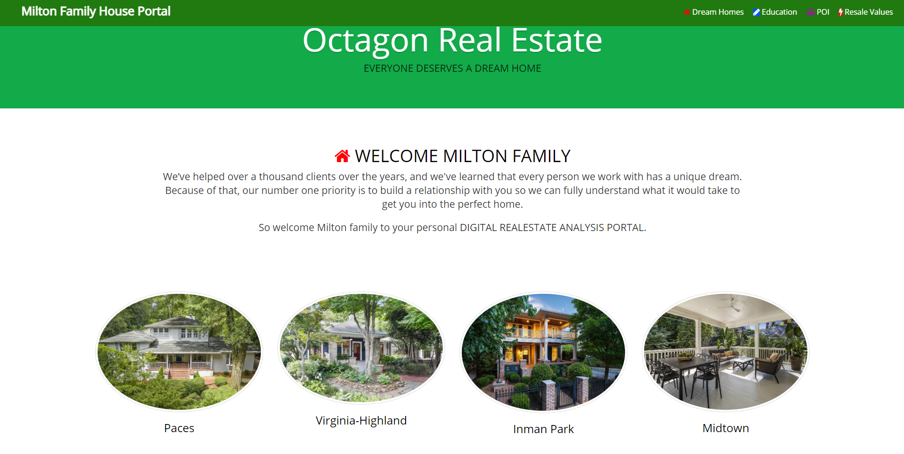
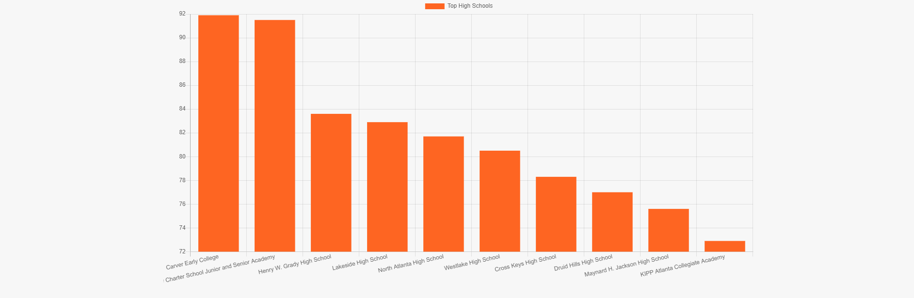
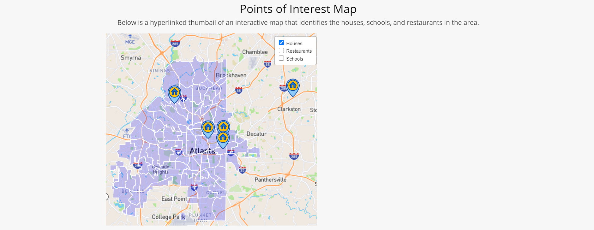
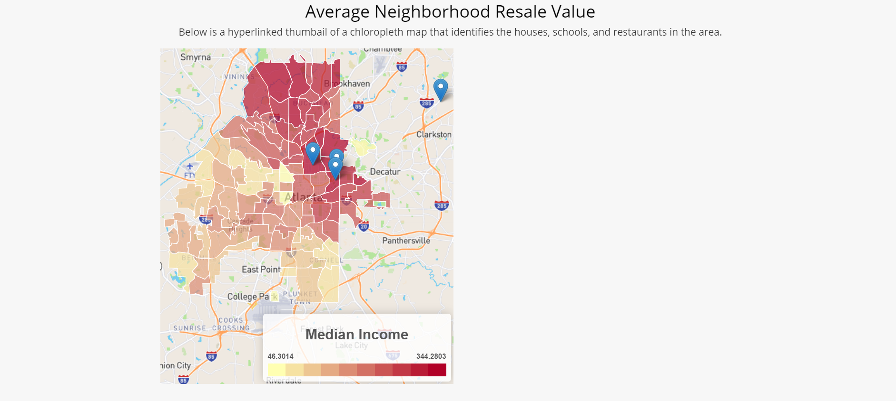

# GroupProject-Octagon_Real_Estate_User_Portal
This repository has been copied from it's original location [HERE](https://github.com/BrandonTownsend/Realestate_Project), so that future updates and changes made by me will not effect the other authors. To see ALL commits to the project please refer to the original.

Similar to real companies like [ProMove](https://www.promove.com/), Octagon Real Estate (ORE) is a fictitious company that focuses on a personalized home buying experience. ORE uses the information you provide alongside advanced search technology to weed out unwanted listings and create a personalized portfolio of homes that match your criteria. This project focuses on creating and designing the personalized portfolio or [user portal](Static/WebBased/realestate.html) that the customers will interact with. Below is the profile for our test family:

### Family
 - Caitlyn Milton
	 - Job(s): Hobbs Law Firm
	 - Title(s): Document Review Specialist
	 - Income: $130,000
- Robert Milton
	- Job(s): Savoury Restaurant and Bar/Art Institute of Atlanta
	- Title(s): Head Chef/Adjunct Culinary Arts Instructor
	- Income: $105,000
 - Children
	 - Sarah (8)
	 - Robert (15)
 - Pets 
	 - Dog x 1
### Criteria
 - $1.5 Million Max (Would prefer cheaper)
 - 3 Bedroom
 - Large backyard
 - Access to top rated schools
 - Nearby restaurants & dining
 
### User Portal
The user portal is made up of graphs and interactive maps based on the criteria provided by the client. For the test families portal, we have ORE's top four proposed houses, graphs showing the top schools in Atlanta based on their College and Career Ready Performance Index (CCRPI) Score, interactive maps consisting of layers for houses, schools and restaurants, and a clickable choropleth map detailing the median price of houses in the area.

---
### Tech Stack
* HTML
* Bootstrap
* CSS
* JavaScript
* Python
* Jupyter Notebook
* D3
* Chart JS

### User Instructions
* Clone the repository: git clone https://github.com/DarrylB32/GroupProject-Octagon_Real_Estate_User_Portal.git 
 * Using your internet browser, open the [realestate](Static/WebBased/realestate.html) file
### Authors
* Darryl Baynes
* [Brandon Townsend](https://www.linkedin.com/in/brandon-townsend-916a2326/)
* [Jennie Lee Gruber](https://www.linkedin.com/in/jennie-lee-gruber-2a299178/)
* [Jake Stanford](https://www.linkedin.com/in/jakestanford28/)

### Additional Notes
